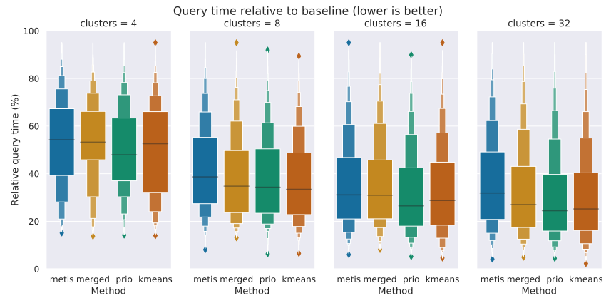
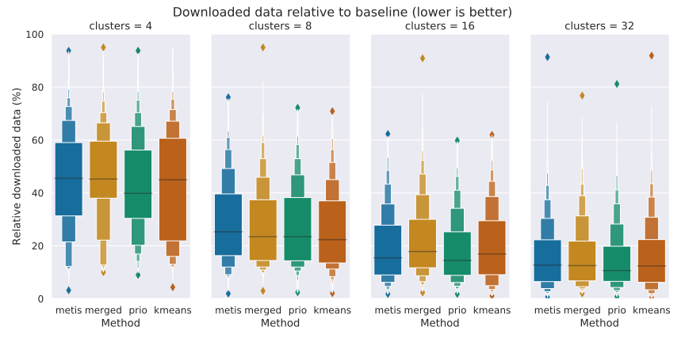
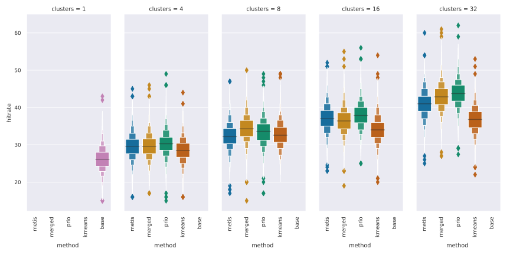
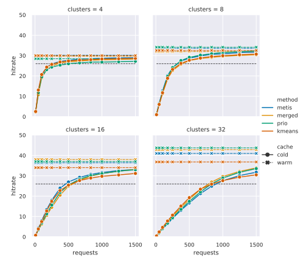

## Evaluation

We have adapted an existing library for client-side route planning so that it can interpret our hypermedia controls, and decide which data to download. This library uses the earliest arrival time variant of the Connection Scan Algorithm. This algorithm, similar to Dijkstra's algorithm, builds a list of which stops are reachable and how long it takes to reach them. A client that knows the location of each stop can also infer which clusters are reachable, so our adapted route planner simply fetches data for all reachable clusters -- slowly growing its list of data sources. We focus on the use-case of client-side route planning because this a relatively demanding application. 

As mentioned in , we use 1 week of Linked Connection as input to train the clustering algorithms. We then used each method to create 4, 8, 16, and 32 clusters. A redis-backed server then creates an ordered list of all connections within every generated region, and exposes these using the hypermedia controls defined in the . The same server also hosts a version of the data with one cluster that contains all the data, i.e. without any geospatial partitioning. Altogether we test 17 different partitionings, each data fragment contains 20 minutes of data. 

We make extensive use of [letter-value plots](cite:cites letter-value-plot) as our results have a long tail, causing conventional visualizations such as box plots to label many results as outliers. These plots show the median value as a black line, and then show the 75%, 87.5%, ... percentile as separate boxes, making it easy to compare these statistics.

### Usability

As a proxy for how _useful_ the geospatially fragmented data is for an end-user, we measure how much work the client has to do to come to the same result. Specifically, how long it takes for the same client to come to an answer with a given partitioning, as well as how much data was downloaded, and compare those values to those of the baseline -- the unpartitioned data. 

5,000 queries were randomly selected from a query log that was given to by the transit the operator itself. All these queries occurred on the same day, but throughout the day.  We eliminate as many variables as possible to isolate the impact of the partitioning; the client and server run on two separate machines on the same local network, a constant 20 ms of latency is added per response, and the client only processes one query at a time. 

<figure id="elapsed">
    
    <figcaption>The median query time with just 4 clusters is already 58% that of the original query times, and using 8 clusters further improves this to 45%. Note the diminishing returns as more clusters are added though, using 16 and 32 clusters lower the relative query times to 41% and 42%. The prio and k-Means methods yield very similar results, while METIS performs significantly worse.</figcaption>
</figure>

<figure id="downloaded">
    
    <figcaption>Using just 4 clusters is enough to reduce the amount of downloaded data to 45% of the original amount of downloaded data, and adding more clusters consistently improves this metric. Although all methods seem competitive in this metric, the prio method has a consistently low median and 75% percentile.</figcaption>
</figure>

 shows that having just a few clusters already significantly improves the query performance, but that adding more clusters has diminishing returns. Even without the overhead of ingesting unnecessary data the client still has to compute the route. The METIS results are somewhat surprising; they are slightly worse across the board, and even become worse when going from 16 to 32 clusters. As  shows, the clusters from METIS are more complex than those from other methods, which creates a heavier workload on the client.  shows that the amount of downloaded data does keep decreasing by adding more clusters, we can even avoid all unnecessary data by creating a cluster per stop.

### Cacheability

Another important feature of Linked Connections is the cacheability of the data fragments, which gives a Linked Connections server its scalability. Because we are making the data more fine-grained, we have to measure the impact this has on the cacheability of the data. Unfortunately, we do not have access to any form of user ID, which makes it hard to benchmark a real world scenario where there are client-side and server-side caches. Instead, we measure how fast a cache warms up in every configuration, and what the hit rate of a warm cache is. These two metrics give an indication of how cacheable the partitioned data is, and how this compares to the cacheability of the original data. 

While running the benchmarks for the usability metrics, we also record which resources are fetched. We then replay these requests, running them through a simulated LRU cache to measure the hit rates. Every partition results in roughly 70 MB of gzipped data per day, and we set the cache size to 20 MB. To measure the hit rates on a warm cache we first run all requests through a cache, and then create 1,000 samples of 500 requests to measure the overall hit rate of each sample. The hit rates on a cold cache are obtained by doing the same starting from a cold cache, and by varying the amount of requests per sample.

<figure id="warm">
    
    <figcaption>Less valuable cache space is wasted on irrelevant data by using a fine-grained partitioning. The median hit rate on a warm cache using the unpartitioned data is 26%, the highest hit rate, 44%, is obtained using the prio method at 32 clusters. The k-Means method scores noticeable worse than the other methods.</figcaption>
</figure>

<figure id="cold">
    
    <figcaption>Line plots of the median cache hit rates per configuration, showing that caches take longer to warm with a fine-grained partitioning. However, each method with 4 or 8 clusters matches the hit rate of the original data on a warm cache (26%) after 350 requests.</figcaption>
</figure>

 and  show that partitioned data can improve the cache hit rate, but that caches take longer to warm up. All methods are competitive with each other at 4 and 8 clusters, but k-Means is outperformed by the other three at 16 and 32 clusters. Although using 8 instead of 4 clusters yields better hit rates on a warm cache, both configurations surpass the baseline warm cache hit rate of 26% after roughly 350 requests. 