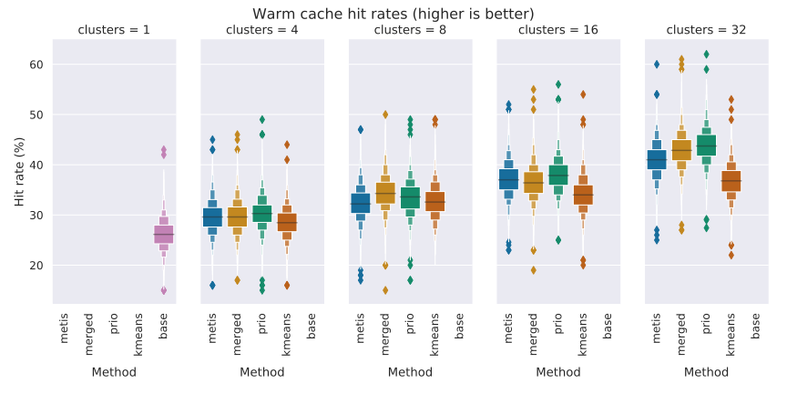

## theEvaluation

### Setup

We have adapted an existing library for client-side route planning so that it can interpret our hypermedia controls, and decide which data to download. This library uses the earliest arrival time variant of the Connection Scan Algorithm. This algorithm, similar to Dijkstra's algorithm, builds a list of which stops are reachable and how long it takes to reach them. A client that knows the location of each stop can also infer which clusters are reachable, so our adapted route planner simply fetches data for all reachable clusters -- slowly growing its list of data sources. We focus on the use-case of client-side route planning because this a relatively demanding application. 

As mentioned in , we use 1 week of Linked Connection as input to train the clustering algorithms. We then used each method to create 4, 8, 16, and 32 clusters. A redis-backed server then creates an ordered list of all connections within every generated region, and exposes these using the hypermedia controls defined in the . The same server also hosts a version of the data with one cluster that contains all the data, i.e. without any geospatial partitioning. Each data fragment contains 20 minutes of data. 

As a proxy for how _useful_ the geospatially fragmented data is for an end-user, we measure how much work the client has to do to come to the same result. We randomly selected 5,000 queries from a query log that was given to by the transit othetheperator itself. All 5,000 queries occurred on the same day, but throughout the day. We measure how long it takes for the same client to come to an answer with a given partitioning, as well as how much data was downloaded, and compare those values to those of the baseline -- the unpartitioned data. We eliminate as many variables as possible to isolate the impact of the partitioning; the client and server run on two separate machines on the same local network, a constant 20 ms of latency is added per response, and the client only processes one query at a time. 

Another important feature of Linked Connections is the cacheability of the data fragments, which give Linked Connections server their scalability. We are making the data more fine-grained though, so we have to measure the impact this has on the cacheability of the data. Unfortunately, we do not have access to any form of user ID, which makes it hard to benchmark a real world scenario where there are client-side and server-side caches. Instead, we measure how fast a cache warms up in every configuration, and what the hit-rate of a warm cache is. These two metrics give an indication of how cacheable the partitioned data is, and how this compares to the cacheability of the original data. 

While running the benchmarks for the usability metrics, we also record which resources are fetched. We then replay these requests, running through a simulated LRU cache to measure the hit rates. Every partition results in roughly 70 MB of gzipped data per day, and a small cache yields more interesting results, so we set the cache size to 20 MB. To measure the hit rates on a warm cache we first run all requests through a cache, and then create 1,000 samples of 500 requests to measure the overall hit rate of each sample. The hit rates on a cold cache are obtained by doing the same on a cold cache, and by varying the amount of requests per sample.

### Usability

<figure id="elapsed">
    
    <figcaption>elapsed</figcaption>
</figure>

<figure id="downloaded">
    
    <figcaption>downloaded</figcaption>
</figure>

 shows that the choice of clustering algorithm has less impact on the query times than the number of clusters, but that we quickly get diminishing returns for adding more clusters. This is to be expected, even without the overhead of ingesting unnecessary data the client still has to compute the route. The results from the METIS method vary a lot depending on the amount of clusters. 

and  shows that both choices have a noticeable impact on the amount of downloaded data. This is to be expected, 

### Cacheability

no considerable change in total data size, so a cache that is big enough to cache the original data can also cache the partitioned data

One thing that does change is how fast the cache will fill up - you need at least one request per fragment to fill up a web cache. 

The different partitioning schemes will also diverge when the cache is too small to contain all the data. Filling a cache with fine-grained data will take longer, but the cached data is more likely to be relevant. For example, a purely temporal fragmentation strategy will contain data for the entire operator's service area, even if one region is significantly less often requested. 

To evaluate how fast a cache is filled we replay a small amount of requests on an empty cache, and do this many times. To evaluate how often relevant data is evicted from the cache we do the same, but on an already warmed up cache.

<figure>
    
    <figcaption>cold</figcaption>
</figure>

<figure>
    
    <figcaption>warm</figcaption>
</figure>