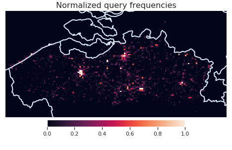

## Method

<figure style="display:flex; flex-wrap:wrap" id="frequencies">
    
	
    <figcaption>
   Visualized on the left are the departure and destination locations based on one week of query logs from the Flemish public transit operator De Lijn. Visualized on the right are the locations of all connections during the same time period. Note that there are many places with a considerable amount of connections that are in low demand. 
    </figcaption>
</figure>

The Linked Connections publishing scheme already a good job at enabling applications to ingest the most relevant data, but each fragment still contains data from the entire transit operator’s service area.  shows that some regions served by the Flemish public transit operator, De Lijn, are more popular than others, implying that it makes sense to fragment by location. 

However, first we should consider what is necessary to make publishing fragmented data viable in the real world. We make a distinction between data owners and data publishers, with a clear distinction between their responsibilities. A data owner focuses on maintaining the data quality, while a data publisher focuses on making the data accessible. Both roles come with their own challenges, and as such it is not uncommon for data owners to consult third parties to publish the data for them. This means that data publishers may not have control over the actual data -- when the data changes they just have to follow. For example, public transit operators routinely add and remove temporary stops due to maintenance works, and these changes have to be reflected in the published data with as little friction as possible. 

### Data

Lead by the insights provided by , we will focus on Flemish public transit network for the remainder of this paper.  Flanders is a small region within Europe, but with 487 inhabitans/km² in 2019 it is also one of the most densely populated . The public transit network is equally dense; at the time of writing there are 35,791 stops spread out over 13,522 km² for a stops density of 2.6 stops/km². There are roughly 1 billion connections on a regular weekday, and the corresponding Linked Connections data results in over 10 billion RDF triples per day.  We use one data from the first whole week of December as the base data in the rest of this section. 

### Clustering

Existing work has focused on clustering stops, or trips, into discrete sets of objects. This means that any time a new stop gets added by the data owner, the data publisher must explicitly label the new stop as well. For clustering algorithms such as k-Means this is relatively easy, but for algorithms such as METIS this means recomputing the entire clustering. Instead of coming up with another clustering algorithms that is easy to update, we propose to publish the clusters differently. Instead of creating discrete sets of stops, we partition the physical world. The resulting partitions are published as separate resources, allowing any agent to infer to which cluster every stop belongs. In other words, data publishers do not have to explicitly label every stop themselves -- the data speaks for itself. 

<figure style="display:flex; flex-wrap:wrap" id="clusterings">
	
    
     
    
	
    <figcaption>The 8 partitions each of the 4 evaluated approaches create. Note that the two methods on the top row create regions of roughly equal sizes, while the approaches at the bottom create regions of varying sizes. The approaches in the left column create regions with simple shapes, while the ones on the right create irregular shapes.</figcaption>
</figure>

#### k-Means

Although k-Means is a simple algorithm, existing work has found it to be [competitive with more complex methods](cite:cites bast2016scalable), so we consider it among the state of the art for this particular use-case. As the name implies, this clustering distributes a given set of points in exactly $$k$$ clusters, where every point belongs to cluster with the nearest cluster mean. Iterative heuristics exist to compute this clustering, we used the implementation from [scikit.learn 0.20.3](https://scikit-learn.org/0.20/modules/clustering.html#k-means) with default parameters, and using the stops' WGS84 coordinates as input. To obtain to wanted spatial partitioning we create a Voronoi diagram using the cluster means as seed points. Because the Voronoi cells of two adjacent points on the convex hull share an infinitely long edge, we add some extra padding points that represent the bounding box of the operator's service area -- and then discard all infinite edges. 

#### METIS

[METIS is another algorithm that is used to partition public transit networks](cite:cites delling2017faster, bast2016scalable), so we consider it to be the state of the art as well. Since it is a graph clustering algorithm, we must represent the public transit network as a graph. We follow the conventional approach of creating a vertex for every stop, and connecting them with an edge if they are connected through a single connection. Every edge is assigned a weight that corresponds to how many connections connect those stops. We used [Python wrapper](https://metis.readthedocs.io/en/latest/) to compute the clustering, using the `contig` option to force contiguous partitions.

The METIS algorith only sees the network as a connectivity graph though -- it does not know anything about the physical location of the stops. This means that even though it creates contiguous partitions, those partitions aren't contiguous in the physical world. We obtain a clean spatial partitioning using an additional post-processing step that 1) creates the Voronoi diagram of all stops, 2) merges all Voronoi cells that belong to the same cluster, and 3) merge isolated rings into the encompassing cluster.

#### Prio

Both k-Means and METIS are general purpose clustering techniques, and both ignore an important feature of the data: k-Means does not consider network connectivity and METIS does not consider physical locations. Although the main goal of this paper is not to find a better clustering technique, we were curious how a simple domain-specific approach compares to traditional methods. 

The algorithm iteratively selects the stops based on which trips pass through it. In the first iteration it selects the stop with the most unique trips, in the subsequent iterations it selects the stop with the most unique trips that the previous stop(s) did not have. As there is a finite amount of trips, this algorithm has a clear termination condition: when all trips are covered by one of the selected stops. After $$k$$ iterations it contains the $k$ most important hubs, which lead us to name this method _prio_. These selected stops are then used as seed points to create a Voronoi diagram.  contains all the necessary code to implement this, up until the creation of the Voronoi diagram.

<figure id="prio">
<pre style="color:#000000;overflow-x: hidden"><code>def prio(k):
    done_trips = set()
    selected_stops = []
    for _ in range(k):
        best_stop = None
        best_stop_score = 0
        for stop, trips in stop_to_trips.items():
            stop_score = len(set(trips) - set(done_trips))
            if stop_score &gt; best_stop_score:
                best_stop = stop
                best_stop_score = stop_score
        selected_stops.append(best_stop)
        done_trips.update(stop_to_trips[best_stop])
    return selected_stops</code>
</pre>
<figcaption>
  The <em>prio</em> method can be implemented in just 14 lines of Python code.
</figcaption>
</figure>

#### Merged

Instead of stopping the previous algorithm after $$k$$ iterations we can also let it terminate, and then use the Jaccard similarity coefficient to merge the two most similar adjacent Voronoi regions until only $$k$$ remain. This makes the process more complex, but existing work has shown good results using hierarchical clustering techniques .

### Hypermedia Controls

The obtained Voronoi regions are published to the web as stand-alone resources using the Hydra and GeoSPARQL vocabularies. The Hydra in this case is used to describe a partitioning as a collection of regions, and the `wktLiteral` datatype from the GeoSPARQL vocabulary is used to describe individual regions. GeoJSON is another common way to define geometries, but since GeoJSON polygons are incompatible with JSON-LD we chose to use a simple string representation: WKT.  contains a JSON-LD snippet of a single partition resource.

<figure id="partitionresource">
<pre style="color:#000000; overflow-x: hidden;"><code>{
&nbsp;&nbsp;"@id": "https://example.org/shapes/prio_4",
&nbsp;&nbsp;"hydra:member": [
&nbsp;&nbsp;&nbsp;&nbsp;{
&nbsp;&nbsp;&nbsp;&nbsp;&nbsp;&nbsp;"@id": "https://example.org/shapes/prio_4/1",
&nbsp;&nbsp;&nbsp;&nbsp;&nbsp;&nbsp;"geo:asWKT": "POLYGON ((4.170761972221639 50.70794391488566, 5.611060049825466 51.96704409851701, 4.233768984483664 54.50221456451739, 3.77479828593018 53.53143994233906, 3.799815048180065 52.18573049093929, 4.170761972221639 50.70794391488566))"
&nbsp;&nbsp;&nbsp;&nbsp;}, ...
  ], ...
}</code>
</pre>
<figcaption>
  JSON-LD representation of a partitioning. Note that both the partitioning as the individual regions are separate resources, which allows other datasets to refer to them.
</figcaption>
</figure>

These partition resources are then be used to fragment Linked Connections data. This separation allows for reusing existing partitions, such as administrative regions. A modified Linked Connections server can ingest a given partitioning, and fragment the data accordingly. The server creates one `hydra:PartialCollectionView` instance per region, and then creates an index of all generated views using the [`tree`](https://github.com/pietercolpaert/TreeOntology) ontology. This ontology is used to link every view to the resource that describes a geospatial area.  contains a JSON-LD snippet of such an index. 

<figure id="partioncontrols">
<pre style="color:#000000; overflow-x: hidden; background: #f5f5f5;"><code>{
&nbsp;&nbsp;"@id": "http://example.org/connections",
&nbsp;&nbsp;"@type": "tree:Node",
&nbsp;&nbsp;"tree:relation": [
&nbsp;&nbsp;&nbsp;&nbsp;{
&nbsp;&nbsp;&nbsp;&nbsp;&nbsp;&nbsp;"@type": "tree:GeospatiallyContainsRelation",
&nbsp;&nbsp;&nbsp;&nbsp;&nbsp;&nbsp;"shacl:path": "geo:contains",
&nbsp;&nbsp;&nbsp;&nbsp;&nbsp;&nbsp;"tree:node": "http://example.org/connections?cluster=https%3A//example.org/shapes/prio_4/1",
&nbsp;&nbsp;&nbsp;&nbsp;&nbsp;&nbsp;"tree:value": {
&nbsp;&nbsp;&nbsp;&nbsp;&nbsp;&nbsp;&nbsp;&nbsp;"@id": "https://example.org/shapes/prio_4/1",
&nbsp;&nbsp;&nbsp;&nbsp;&nbsp;&nbsp;&nbsp;&nbsp;"geo:asWKT": "POLYGON ((4.170761972221639 50.70794391488566, 5.611060049825466 51.96704409851701, 4.233768984483664 54.50221456451739, 3.77479828593018 53.53143994233906, 3.799815048180065 52.18573049093929, 4.170761972221639 50.70794391488566))",
&nbsp;&nbsp;&nbsp;&nbsp;&nbsp;&nbsp;&nbsp;&nbsp;"@type": "geo:Geometry"
&nbsp;&nbsp;&nbsp;&nbsp;&nbsp;&nbsp;}
    }, ...
  ], ...
}</code>
</pre>
<figcaption>
  JSON-LD representation of a view index. The <code>tree:node</code> property points to a <code>hydra:PartialCollectionView</code>, which is a connections page from original Linked Connections specification. The <code>tree:value</code> property defines which geospatial area that view covers.
</figcaption>
</figure>